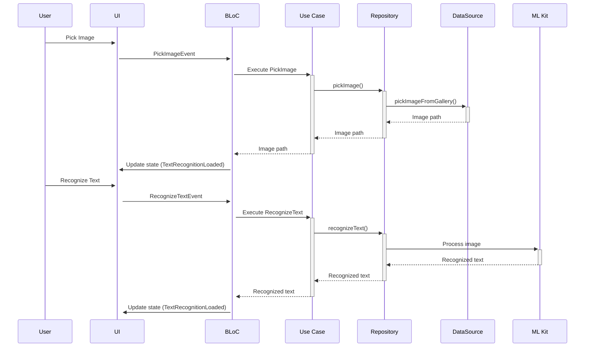

# Text Recognizer App

[](https://flutter.dev)
[](https://bloclibrary.dev)


A Flutter application for text recognition using Google's ML Kit, built with Clean Architecture and BLoC pattern.


## Features

- 📷 Image selection from device gallery
- 🔍 Text recognition using ML Kit OCR
- 🎯 Clean Architecture implementation
- 🧩 BLoC state management
- 🚦 Error handling and loading states
- 📱 Responsive UI design

## Tech Stack

- **Framework**: Flutter
- **State Management**: BLoC
- **OCR Engine**: Google ML Kit
- **Image Picker**: image_picker
- **Architecture**: Clean Architecture (Data-Domain-Presentation)
- **Dependency Injection**: Flutter Bloc

## Installation

1. **Prerequisites**
   - Flutter SDK (>=3.0.0)
   - Android Studio/Xcode (for platform-specific builds)

2. **Clone the repository**
   ```bash
   git clone https://github.com/yourusername/text-recognizer.git
   cd text-recognizer
   ```

3. **Install dependencies**
   ```bash
   flutter pub get
   ```

4. **Run the app**
   ```bash
   flutter run
   ```

## Project Structure

```
lib/
├── core/
├── data/
│   ├── datasources/
│   ├── models/
│   └── repositories/
├── domain/
│   ├── entities/
│   ├── repositories/
│   └── usecases/
└── presentation/
    ├── bloc/
    ├── pages/
    └── widgets/
```

## Text Recognition Workflow

1. **Image Selection**  
   Users pick an image from their gallery using the image picker
2. **Image Processing**  
   Selected image is converted to ML Kit compatible format
3. **OCR Processing**  
   ML Kit processes the image and extracts text
4. **Result Display**  
   Recognized text is displayed in a scrollable view



## Before You Run

**Android Setup** (android/app/src/main/AndroidManifest.xml)
```xml
<uses-permission android:name="android.permission.READ_EXTERNAL_STORAGE"/>
```

**iOS Setup** (ios/Runner/Info.plist)
```xml
<key>NSPhotoLibraryUsageDescription</key>
<string>Need photo library access to pick images</string>
```


## Contributing

Contributions are welcome! Please follow these steps:
1. Fork the project
2. Create your feature branch (`git checkout -b feature/AmazingFeature`)
3. Commit your changes (`git commit -m 'Add some AmazingFeature'`)
4. Push to the branch (`git push origin feature/AmazingFeature`)
5. Open a Pull Request

## License

Distributed under the MIT License. See `LICENSE` for more information.

## Acknowledgments

- [Google ML Kit](https://developers.google.com/ml-kit)
- [Flutter Bloc Library](https://bloclibrary.dev)
- [Clean Architecture](https://blog.cleancoder.com/uncle-bob/2012/08/13/the-clean-architecture.html)

